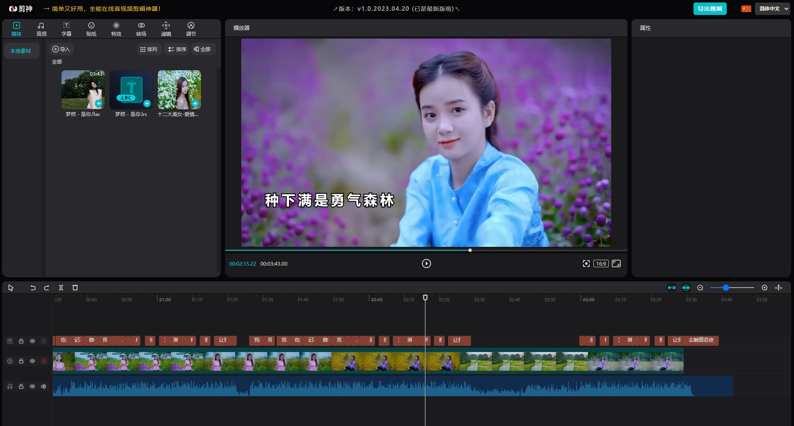
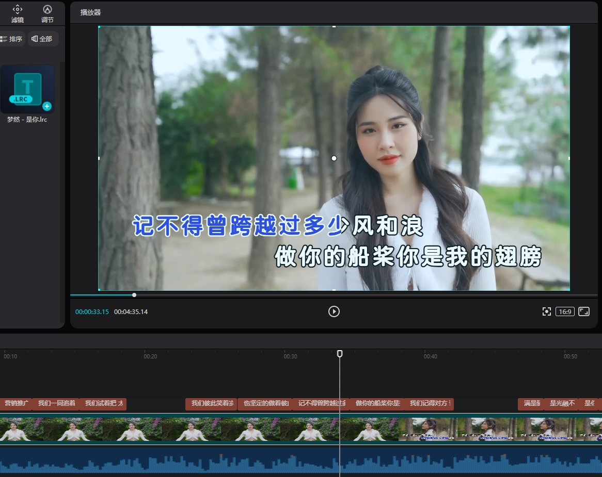
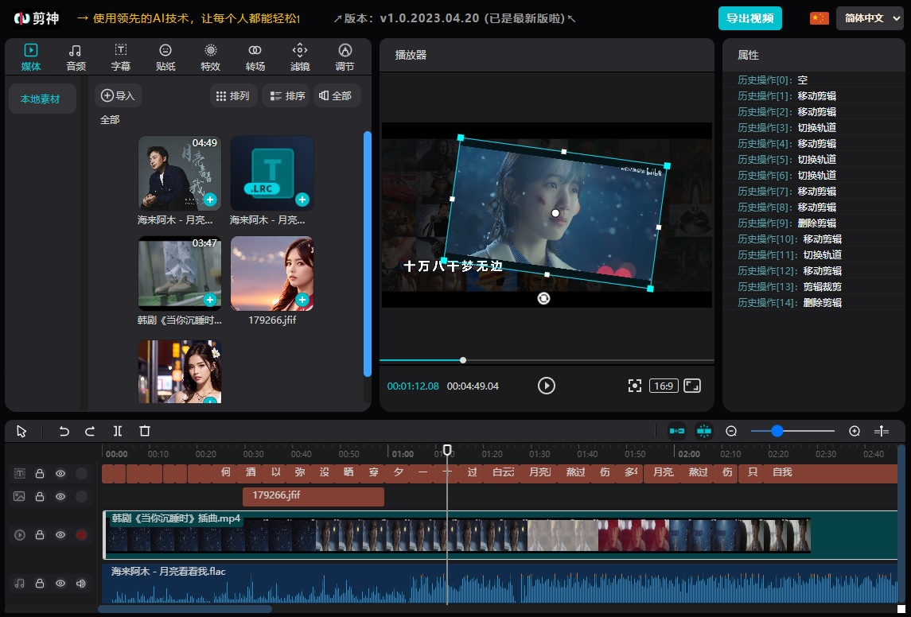
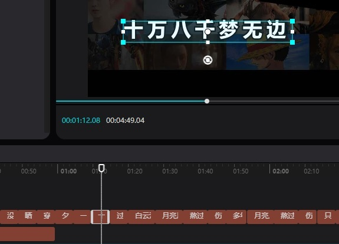
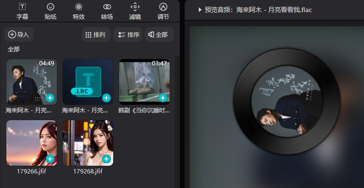
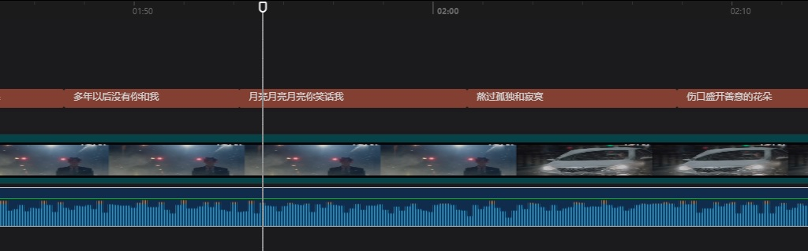
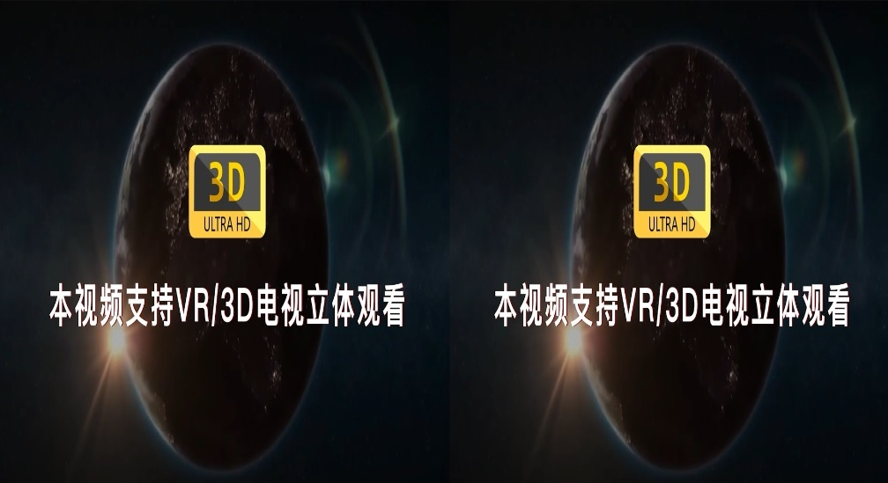
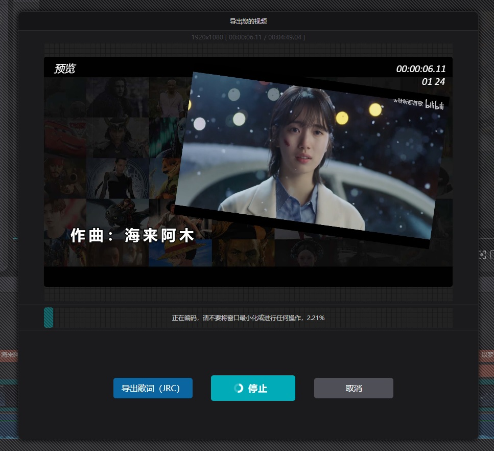

# JianshenVideoEditorWeb

**《剪神》简介：一个跨平台Web（音频/视频）在线剪辑神器！**  
**Introduction to "Jianshen": a cross-platform Web (audio/video) online editing tool!**  

  

它小巧轻量，极速加载！完全基于vue.js，在Chrome/Edge等现代浏览器中跨平台运行~  
It's small and lightweight, and loads extremely fast! Based entirely on vue.js,   
it runs cross-platform in modern browsers such as Chrome/Edge~  

谁会使用它？卡拉OK/MV，影视解说，2D/3D动画制作，音视频剪辑，短视频等~  
现在它还很年轻，功能很少，但是 . . . ~  
或许有一天，它将会成为全球领先的在线音视频编辑工具，谁知道呢？  

Who will use it? Karaoke/MV, video commentary,   
2D/3D animation production, audio and video editing, short video, etc.~  
Right now it's very young and has few features, but . . . ~ Maybe one day,   
it will become the world's leading online audio and video editing tool, who knows?  

---

**1，剪神演示：<a href="https://juntaosun.github.io/JianshenVideoEditorWeb/" target="_blank">➤ [ <u>点击这里，在线DEMO ( Click here for online DEMO )</u> ]**

---

>关于项目（非商业）：  
个人业余时间开发的学习项目，基于vue.js，若您对此项目感兴趣，欢迎点点小星星。

>About the project (non-commercial):  
A learning project developed in my spare time,   
based on vue.js, if you are interested in this project, welcome to little stars.  

---

以下是演示版已经实现的功能，(版本V1.0)：  
The following are the functions that have been implemented in the demo version  
(不排除部份功能有BUG，请在Issues进行提交，平时较忙会尽量抽空查看验证)

- [x] 视频剪辑,video clip     (.mp4 / .webm 以Chrome/Edge)
- [x] 视频导出,video export   .mp4 / .webm
- [x] 音频剪辑,audio clip     (.mp3 / .flac / .wav / .ogg 以Chrome/Edge)
- [x] 音频导出,audio export   .wav
- [x] 图片剪辑,picture clip   (.jpg / .png / .webp 以Chrome/Edge)
- [x] 视频/图片/文字可视化编辑
- [x] Video/picture/text visual editing
- [x] 任意轨道编辑 (拖动/剪裁/调整/缩放/过渡/添加/删除)
- [x] Arbitrary track editing (drag/crop/resize/scale/transition/add/delete)
- [x] 轨道历史记录 (撤销/重做，部份实现)
- [x] Track history (undo/redo, partially implemented)
- [x] 资源预览 (音频预览播放/视频预览播放)
- [x] Resource preview (audio preview playback/video preview playback)
- [x] 转场效果 (核心功能已实现)
- [x] Transition effect (core function has been implemented)
- [x] 轨道缩放,track zoom
- [x] 轨道吸附,orbital snap
- [x] 对齐功能,Alignment function
- [x] 轨道音量调节以及静音
- [x] Track volume adjustment and mute
- [x] 字幕导入 (LRC/ASS/VTT)
- [x] Subtitle import (LRC/ASS/VTT)
- [x] 字幕导出 (JRC)
- [x] 卡拉OK字幕,Karaoke Subtitles
- [x] 轨道AI语音转字幕 (由于AI需要GPU服务器或第三方接口，暂时仅Electron桌面版支持)
- [x] Track AI speech to subtitles (only supported by Electron desktop version)
- [x] 目前固定导出为1080P分辨率(1920x1080)，多分辨率未完全实现
- [x] At present, the fixed export is 1080P resolution (1920x1080)
- [ ] 更多功能... (欢迎在issues中提出或留言)
- [ ] Welcome to propose or leave a message in issues

---

**1，剪神演示：<a href="https://juntaosun.github.io/JianshenVideoEditorWeb/" target="_blank">➤ [ <u>点击这里，在线DEMO</u> ]**

---
界面截图 Interface screenshot：

  
编辑界面 edit interface

  
卡拉OK字幕 Karaoke Subtitles

  
整体风格 Overall style

  
可视化编辑 visual editing

  
音视频预览 Audio and video preview

  
轨道编辑 track edit

  
3D立体字幕及视频导出 3D stereoscopic subtitles and video export

  
视频导出 video export

---

开发环境,development environment：vue.js 
>(Chrome94+ / Edge94+)  

桌面环境,desktop environment：Electron/nodejs  

>(Windows10+,MacOS)  

---

重要声明：此项目非商业，主要用于个人学习目的。   
未经许可，任何人不得擅自修改用于任何商业性质，否则请自行承担一切责任！

IMPORTANT DISCLAIMER: This project is non-commercial and primarily for personal learning purposes.  
Without permission, no one is allowed to modify it for any commercial purpose,   
otherwise please bear all the responsibilities yourself!   

---

内容翻译由谷歌提供：Translation provided by Google  